# Assignment 5

Isak Jonsson, 2024-05-13\
isak.jonsson@gmail.com

Available on https://github.com/isakj/D7015B/tree/master/assignment5

## Table of contents

- [Assignment 5](#assignment-5)
  - [Table of contents](#table-of-contents)
  - [Task 1 - Ground level](#task-1---ground-level)
    - [Problem](#problem)
    - [Analysis and implementation](#analysis-and-implementation)
      - [Method 1](#method-1)
      - [Method 2](#method-2)
    - [Result](#result)
    - [Discussion](#discussion)
  - [Task 2 - Clustering](#task-2---clustering)
    - [Problem](#problem-1)
    - [Analysis and implementation](#analysis-and-implementation-1)
      - [Naïve $cluster(\\epsilon)$ analyis](#naïve-clusterepsilon-analyis)
      - [The `kneed` library](#the-kneed-library)
    - [Result](#result-1)
  - [Task 3 - Size of the largest cluster](#task-3---size-of-the-largest-cluster)
    - [Problem](#problem-2)
    - [Analysis and implementation](#analysis-and-implementation-2)
    - [Further analysis](#further-analysis)
    - [Result](#result-2)
  - [Appendix](#appendix)
    - [Dataset 2](#dataset-2)

## Task 1 - Ground level

### Problem

Find the ground level in a point cloud, to separate out those points
before clustering.

### Analysis and implementation

To start with, a histogram with the point frequency by height ($z$) was
created, each bin being 1 dm (0.1 m).

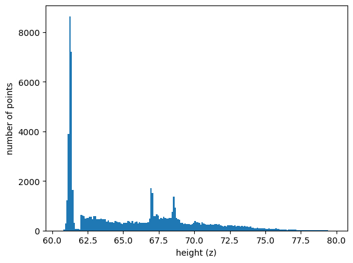\
*Figure 1. Histogram, number of points per height interval (bin size=0.1 m). 
Source: Dataset 1.*

It is clear that the ground level stands out as a peak. 
We want to find the end of that peak.
Two methods are considered.

#### Method 1

1. Find the median of the count values of the histogram, $\hat{x}$.

2. Iterate over the bins, from lowest (smallest $x$) to highest. 
When the count value exceed $3 \hat{x}$, proceed to 3.

3. Continue iterating over the bins. 
When the count value subceeds $2 \hat{x}$, stop.
Take the midpoint of the current bin as threshold.

For the graph above, this algorithm gets the value 61.55.

#### Method 2

1. Iterate over the bins, from lowest (smallest $x$) to highest.
Call the current bin $i$.
When $$\frac{count_{i-3}+count_{i-2}}{count_{i-1}+count_{i}} < 0.7$$
Stop. Take the midpoint of the current bin as threshold.

For the graph above, this algorithm gets the value 62.15

### Result

For the rest of the assignment, Method 2 is used.

### Discussion

The breakpoint for the two algorithms are not really the same.
The first method finds a breakpoint within the downward slope.
The second method finds a breakpoint at the base of the slope
(or a little bit after). Hence, Method 1 can be said to be more cautious.

Of course, there should be more safeguards to handle more cases.
But for the two datasets provided, both methods perform well.

## Task 2 - Clustering

### Problem

Find a good value for $\epsilon$ for the DBSCAN value.
Too small $\epsilon$: clusters are not continuous.
Too large $\epsilon$: clusters of different elements might be grouped together.

### Analysis and implementation

First of all, a visual study of the point cloud identifies some
trees, some bushes, the catenary and the corresponding poles.
The objective should be to have a 1-1 relation between these 
physical objects and the identified clusters.

It is worth noting that in order to simplify the analysis,
the minimum number of samples parameter in DBSCAN is set to 5.

#### Naïve $cluster(\epsilon)$ analyis

To get a feeling for how the choice of $\epsilon$ affects the number of
clusters, we run DBSCAN with a lot of different values of $\epsilon$.
This is normally not be practical as it consumes a lot of CPU,
but it helps understanding the characteristics.

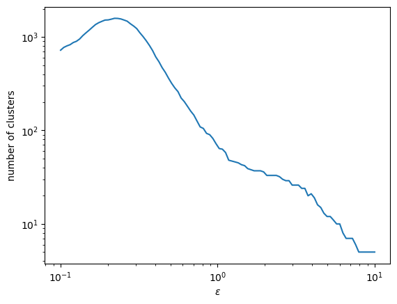\
*Figure 2. Number of clusters as a function of $\epsilon$.
Source: Dataset 1.*

For small values of $\epsilon$, the number of clusters actually goes down.
This is due to many points becomes islands and are treated as noise.

We can also plot the distance to the nearest neighbor for all points.
At first, I did a simple double loop, which did the job, but consumes
$O(n^2)$ time and $O(n^2)$ space.
Luckily, there is already a library for Python which computes the nearest neighbor
in a more efficient way. 
Even better, it produced the same result as my for loops.

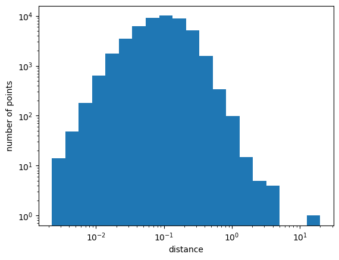\
*Figure 3. Histogram of distribution of distance to nearest neighbor. Logarithmic bin width.
Source: Dataset 1.*

#### The `kneed` library

There is a library which implements an algorithm for automatic knee detection.
It uses the output of the aforementioned nearest neighbor data to find a
appropriate value for $\epsilon$.
The input to the kneed library is the distribution of the distances between points.
However, I found that using the smallest distance for every point did not get
a very good value using kneed. Instead, we use the 30th closest value for every point.
In the algorithm, the curve is fitted by a polynomial or piece-wise approximation.
I was not able to get the polynomial fitting to work very well, probably
because the knee is very sharp. When using piece-wise approximation,
the kneed library found $\epsilon \approx 0.911$ for dataset 1, which is what is used below.

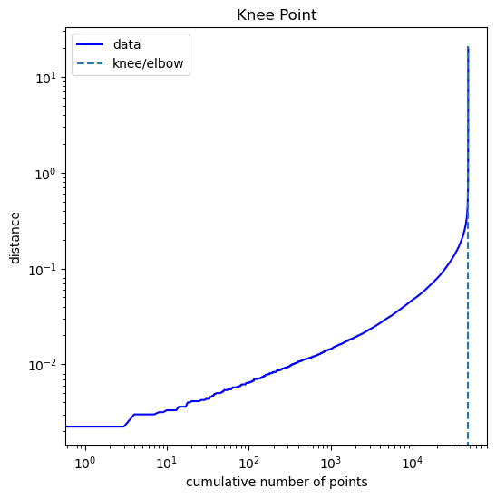 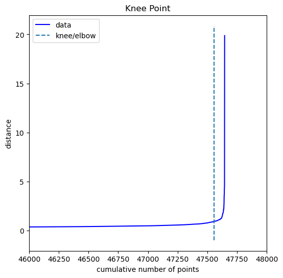\
*Figure 4 and Figure 5. Knee analysis based on 30th closest neighbor. Source: Dataset 1.*

Note that this value of $\epsilon$ corresponds to the knee around $10^0$ in Figure 3.

### Result

The value $\epsilon \approx 0.911$ is used as a good value.
For more analysis of the sensibility of $\epsilon$, see below.

## Task 3 - Size of the largest cluster

### Problem

We want to find the size of the largest cluster, where the largest cluster is
defined as the largest surface of the bounding box of the cluster as projected on the ground.
The idea is that this is the catenary, and we want to find the size of this.

### Analysis and implementation

Given the clustering, this is trivial. We loop over the cluster labels and calculate the size
of the bounding box for that cluster. Then we sort the sizes and we get the largest one.

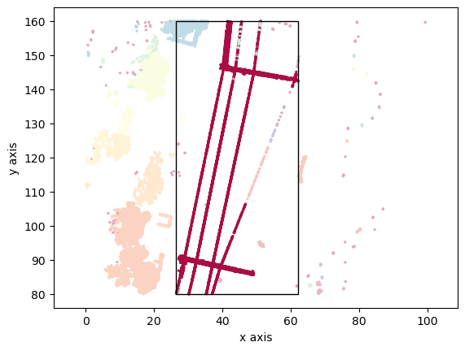\
*Figure 6. Cluster projected on ground ($z=0$), with bounding box for the largest cluster. $\epsilon \approx 0.911$.
Source: Dataset 1.*

### Further analysis

Given the objective of Task 3, we can now go back and analyze the impact of the choice of $\epsilon$
for the result of Task 3. 
In order to do this, we run the analysis above for a number of values of
$\epsilon$ and for each value, we calculate the size of the largest cluster.
In addition to this, we calculate the percentage of the points within the bounding box that belongs 
to the this largest cluster. 
It should be noted that 100% is not necessarily the right answer.
There might very well be other objects within the bounding box, which should not be part of the 
detected catenary. 
An example is in the figure below, where part of the catenary is not part
of a contiguous cluster.

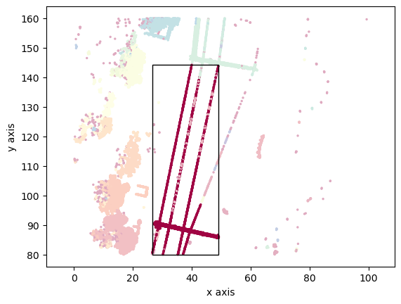\
*Figure 7. Cluster projected on ground ($z=0$), with bounding box for the largest cluster. $\epsilon=0.7$.
Source: Dataset 1.*

The result of the analysis of the bounding box with regards to $\epsilon$ is shown in Figure XY.

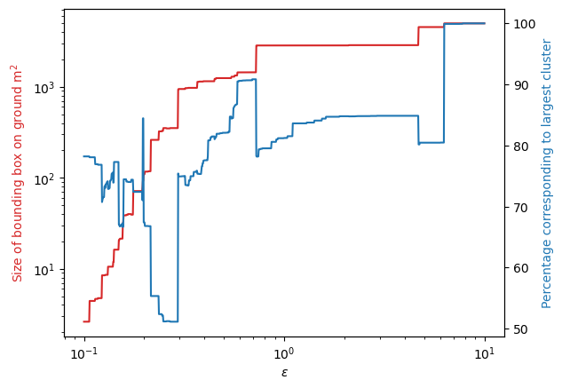\
*Figure 8. Cluster projected on ground the largest cluster, and the part of points withing the bounding box
corresponding to that cluster.
Source: Dataset 1.*

It is clear that the bounding box finds a stable plateau for $0.73 < \epsilon < 4.7$, where the 
correct value for the bounding box is found.
At the same time, the percentage of points belong to the cluster increases while filling the
gaps in the catenaries. As $\epsilon$ grows higher, a larger part of the projected area of all
points becomes part of the cluster, until everything is one single cluster.

### Result

The size of the largest cluster is estimated to 2849 m$^2$, with bounding box 
$(26.50, 62.14) - (80.02, 159.96)$.

## Appendix

### Dataset 2

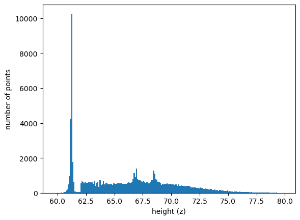\
*Figure 9. Histogram, number of points per height interval (bin size=0.1 m). 
Source: Dataset 2.*

Ground level was also here found to be 62.15 m.

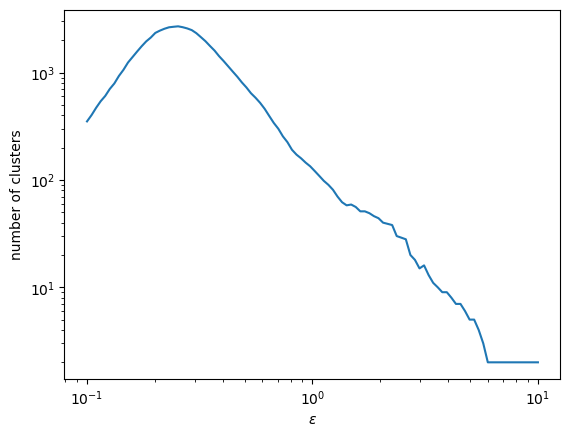\
*Figure 10. Number of clusters as a function of $\epsilon$.
Source: Dataset 2.*

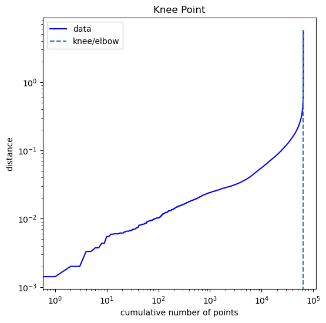 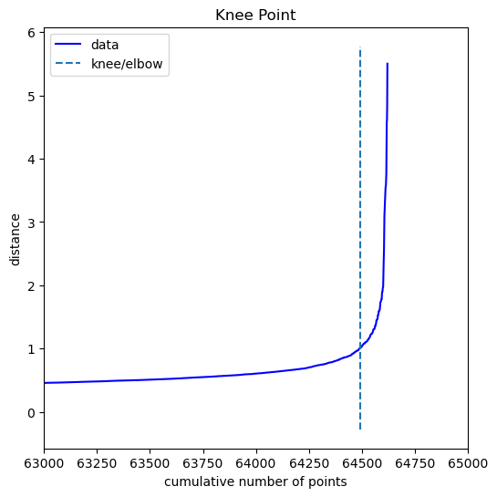\
*Figure 11 and Figure 12. Knee analysis based on 30th closest neighbor. Source: Dataset 2.*

Best $\epsilon$ was estimated to be 1.004.

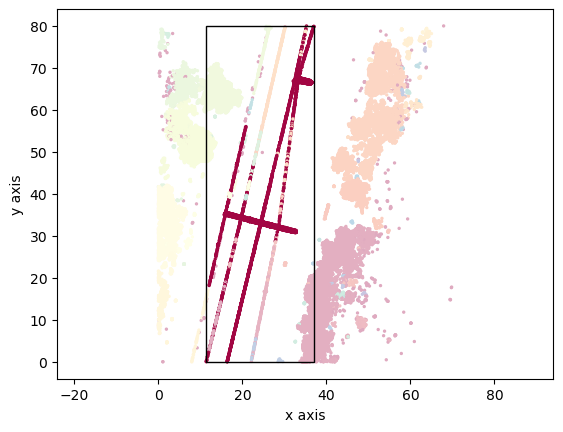\
*Figure 13. Cluster projected on ground ($z=0$), with bounding box for the largest cluster. $\epsilon \approx 1.004$.
Source: Dataset 2.*

Comment. Apparently $\epsilon$ is a little bit too small to get the correct value of the bounding box,
as the lower leftmost part is not included in the box.

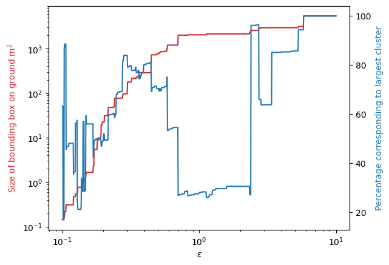\
*Figure 14. Cluster projected on ground the largest cluster, and the part of points withing the bounding box
corresponding to that cluster.
Source: Dataset 2.*

The largest bounding box/percentage graph for Dataset 2 is quite spectacular.
We see the same plateau as for Dataset 1 for $0.70 < \epsilon < 2.34$,
with a bounding box area of 2144 m$^2$ for our optimal $\epsilon$
(which, again, does not include the lower leftmost part).

As $\epsilon$ exceeds 2.34, the clustering algorithm merges the two
tree parts to the right, so that the new merged cluster has the largest
bounding box.
